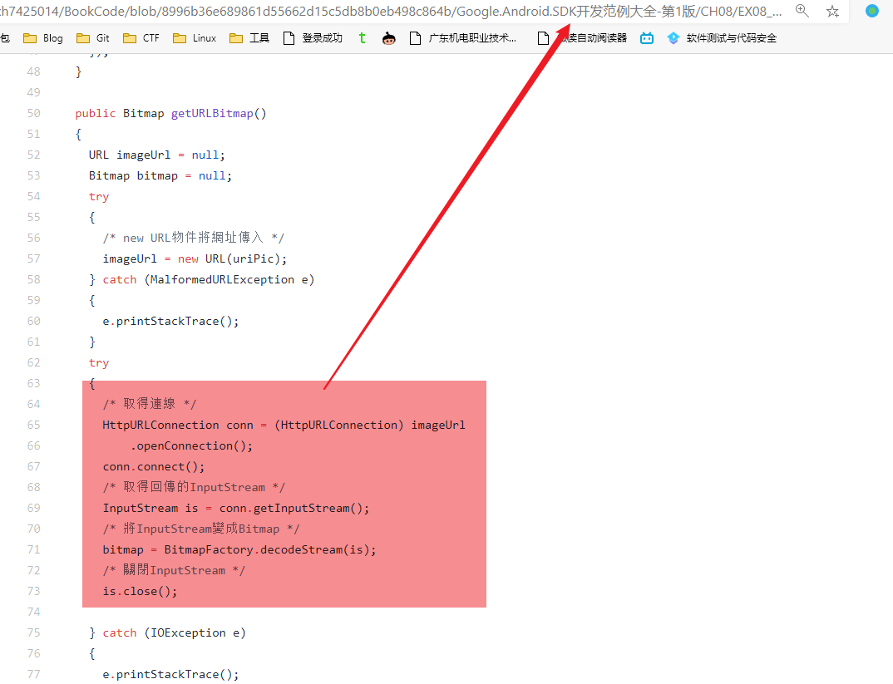
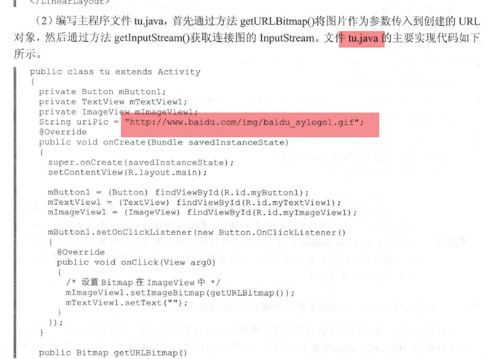

# gdmec-android-network

移动网络应用开发这门课的源码，而这门课大部分都是《精通ANDROID网络开发》这本书的，而这本书的代码大部分都是来源于网络的

比如这里

[地址](https://github.com/bxh7425014/BookCode/blob/8996b36e689861d55662d15c5db8b0eb498c864b/Google.Android.SDK%E5%BC%80%E5%8F%91%E8%8C%83%E4%BE%8B%E5%A4%A7%E5%85%A8-%E7%AC%AC1%E7%89%88/CH08/EX08_06/src/irdc/ex08_06/EX08_06.java)

只要你会用 github / google 搜索，基本都能找到